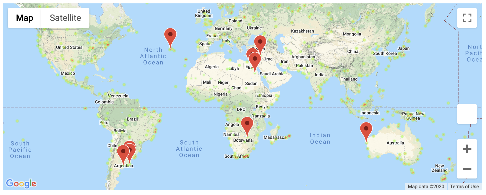

# python-api-challenge

## WeatherPy Trends

1. There is no correlation between the Humidity % and Latitude in the Southern Hemisphere as the r-squared value is 1.85.
2. In the Northern Hemisphere, there is a strong, negative correlation between Max Temperature and Latitude with an r-squared value of .52. Meanwhile, in the Southern Hemisphere, there is a strong, positive correlation between Max Temperature and Latitude with an r-squared value of .75.
3. There is a weak, positive correlation between Cloudiness % and Latitude in the Northern Hemisphere as the r-squared value is .04 and no correlation between Cloudiness % and Latitude in the Southern Hemisphere as the r-squared value is .0004.

## VacationPy HeatMap

